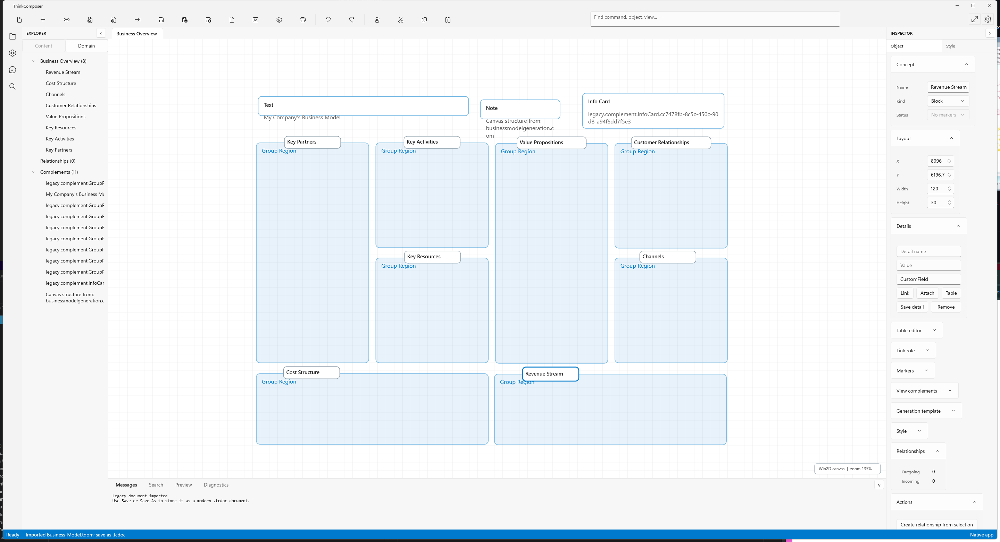

# ThinkComposer2

ThinkComposer2 is a modernized fork of ThinkComposer focused on a native Windows desktop experience.



## Current Direction

- Native WinUI 3 application for Windows.
- Modern .NET codebase targeting .NET 10 for the new app surface.
- Legacy ThinkComposer package import through a bridge layer.
- Modern document format support with `.tcdoc`.
- Legacy `.tdom` and `.tcom` import support.
- View-only `.tcview` compatibility where appropriate.
- Light and dark themes inspired by VS Code.
- Reproducible publish and release scripts.

## Status

The WinUI app covers the main editor workflow:

- Create, open, import, merge, and save documents.
- Render concepts, relationships, group regions, and visual complements.
- Pan, zoom, select, multi-select, move, delete, undo, and redo.
- Edit document structure through Explorer and Inspector panels.
- Edit concept details, markers, styles, tables, links, attachments, and generation templates.
- Export HTML/SVG/PDF, generate PDF/HTML reports, presentations, and printable HTML previews.
- Build portable release artifacts with manifests and SHA-256 verification.

Remaining product decisions are tracked in:

- `docs/superpowers/specs/2026-05-08-winui-parity-audit.md`
- `docs/superpowers/specs/2026-05-08-winui-release-guide.md`

## Requirements

- Windows 10 1809 or newer.
- .NET 10 SDK.
- Windows App SDK dependencies restored from NuGet.
- .NET Framework 4.8 targeting support for the legacy bridge/tests.

## Build

```powershell
dotnet build ThinkComposer.WinUI\ThinkComposer.WinUI.csproj `
  -p:Configuration=Debug `
  -p:Platform=x86
```

## Run

```powershell
dotnet run --project ThinkComposer.WinUI\ThinkComposer.WinUI.csproj `
  -p:Configuration=Debug `
  -p:Platform=x86
```

Open a legacy sample:

```powershell
dotnet run --project ThinkComposer.WinUI\ThinkComposer.WinUI.csproj `
  -p:Configuration=Debug `
  -p:Platform=x86 `
  -- PredefinedContent\Business_Model.tdom
```

## Publish A Portable Build

```powershell
powershell -ExecutionPolicy Bypass -File scripts\release-winui.ps1 `
  -Configuration Release `
  -RuntimeIdentifiers win-x64 `
  -OutputRoot artifacts\winui-internal `
  -UpdateChannel internal
```

The release script creates:

- `artifacts\winui-internal\ThinkComposer.WinUI-Release-win-x64.zip`
- `artifacts\winui-internal\release-index.json`
- per-runtime `release-manifest.json`
- per-runtime `artifact-hashes.json`

Verify the release index:

```powershell
powershell -ExecutionPolicy Bypass -File scripts\verify-winui-release.ps1 `
  -IndexPath artifacts\winui-internal\release-index.json
```

## Smoke Test

Run the UI smoke test against a clean published artifact:

```powershell
powershell -ExecutionPolicy Bypass -File scripts\smoke-winui-ui.ps1 `
  -ExecutablePath artifacts\winui-internal\Release-win-x64\ThinkComposer.WinUI.exe `
  -DocumentPath PredefinedContent\Business_Model.tdom `
  -ExpectedTitle "Business Overview" `
  -StartupSeconds 8
```

## Original Project

This fork is based on the original ThinkComposer project by Nestor Marcel Sanchez Ahumada.

Original wiki:

https://github.com/nmarcel/ThinkComposer/wiki
